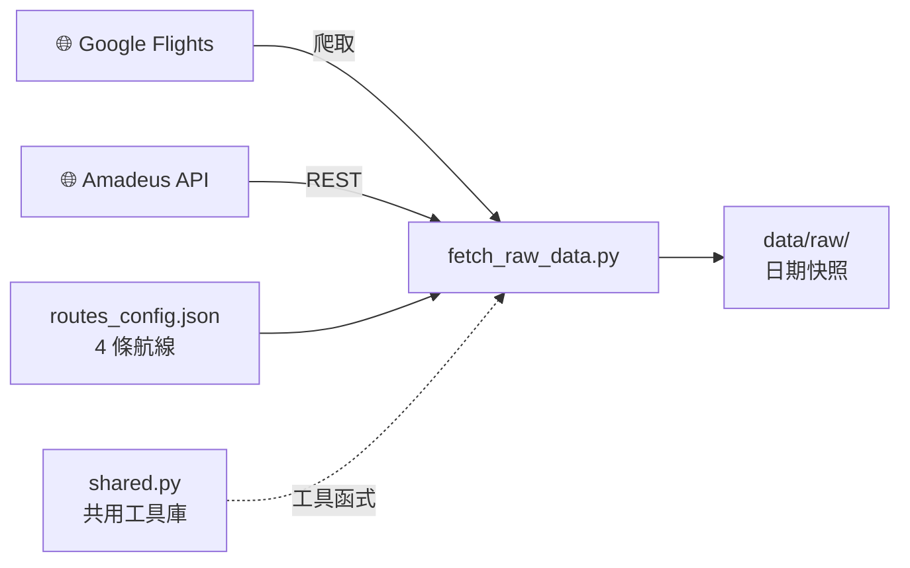
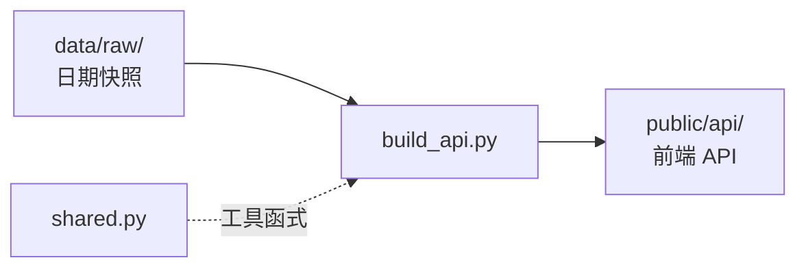
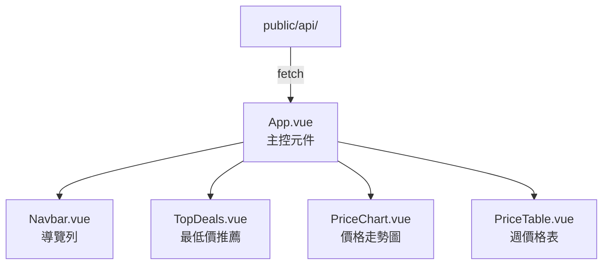
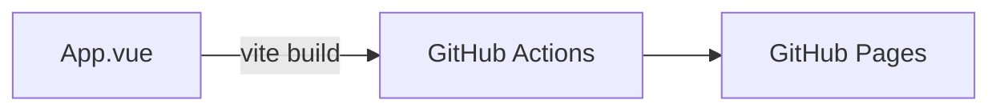

# flight-radar 文件

## 📁 文件導覽

| 文件 | 說明 |
|------|------|
| [專案架構](./architecture.md) | 系統架構與模組關係 |
| [資料流程](./data-flow.md) | 從爬蟲到前端的完整資料流 |
| [建置部署](./build-deploy.md) | 開發環境建置與 CI/CD 流程 |
| [Code Review 流程](./code-review-flow.md) | 代碼審查執行流程與結果 |
| [Code Review 報告](../CODE-REVIEW-REPORT.md) | 代碼審查完整報告 |

## 🗺️ 快速總覽

### 📥 資料抓取層

外部資料源透過 Python 腳本抓取，儲存為日期快照。

### 🏗️ API 建構層

從日期快照產生前端可用的靜態 API 檔案。

### 🎨 前端 Vue 3

前端從 API 載入資料，透過元件呈現票價資訊。

### 🚀 部署

前端建置後透過 GitHub Actions 部署到 GitHub Pages。

