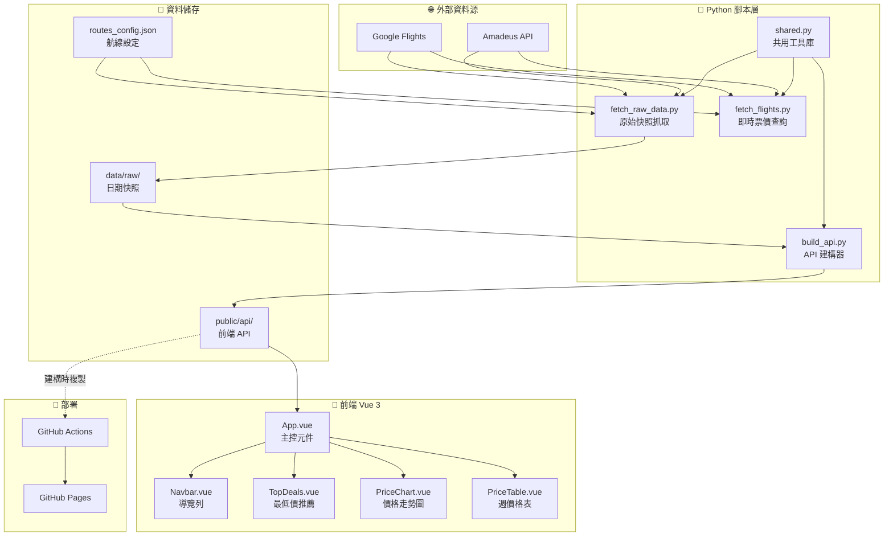

# flight-radar 文件

## 📁 文件導覽

| 文件 | 說明 |
|------|------|
| [專案架構](./architecture.md) | 系統架構與模組關係 |
| [資料流程](./data-flow.md) | 從爬蟲到前端的完整資料流 |
| [建置部署](./build-deploy.md) | 開發環境建置與 CI/CD 流程 |
| [Code Review 流程](./code-review-flow.md) | 代碼審查執行流程與結果 |
| [Code Review 報告](../CODE-REVIEW-REPORT.md) | 代碼審查完整報告 |

## 🗺️ 快速總覽

---

> 本文件由技術文件工程師自動產生，基於專案原始碼分析。
