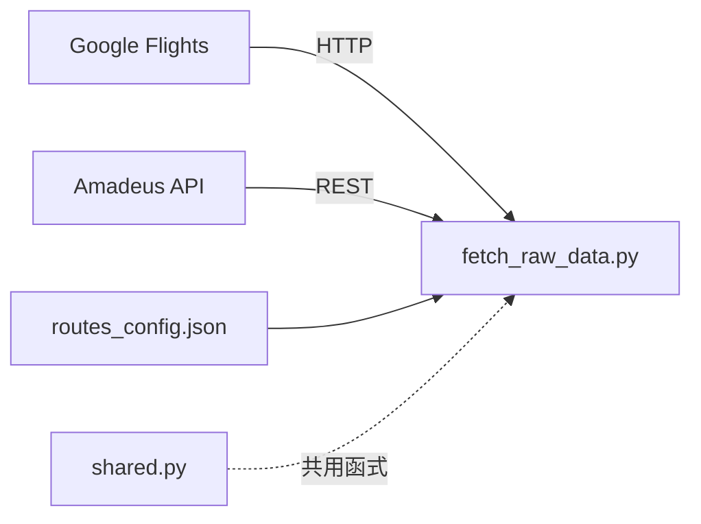
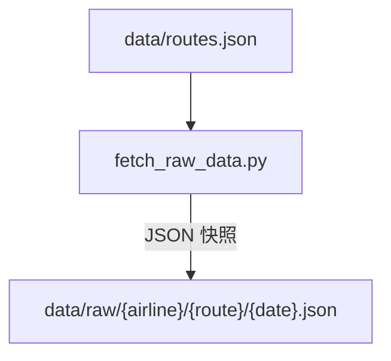
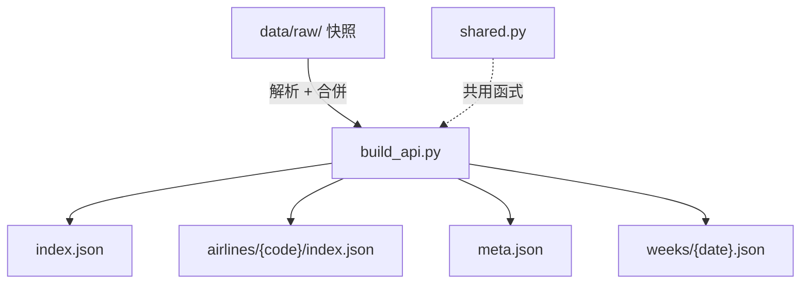
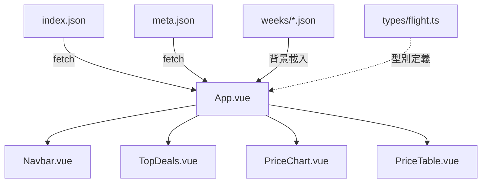
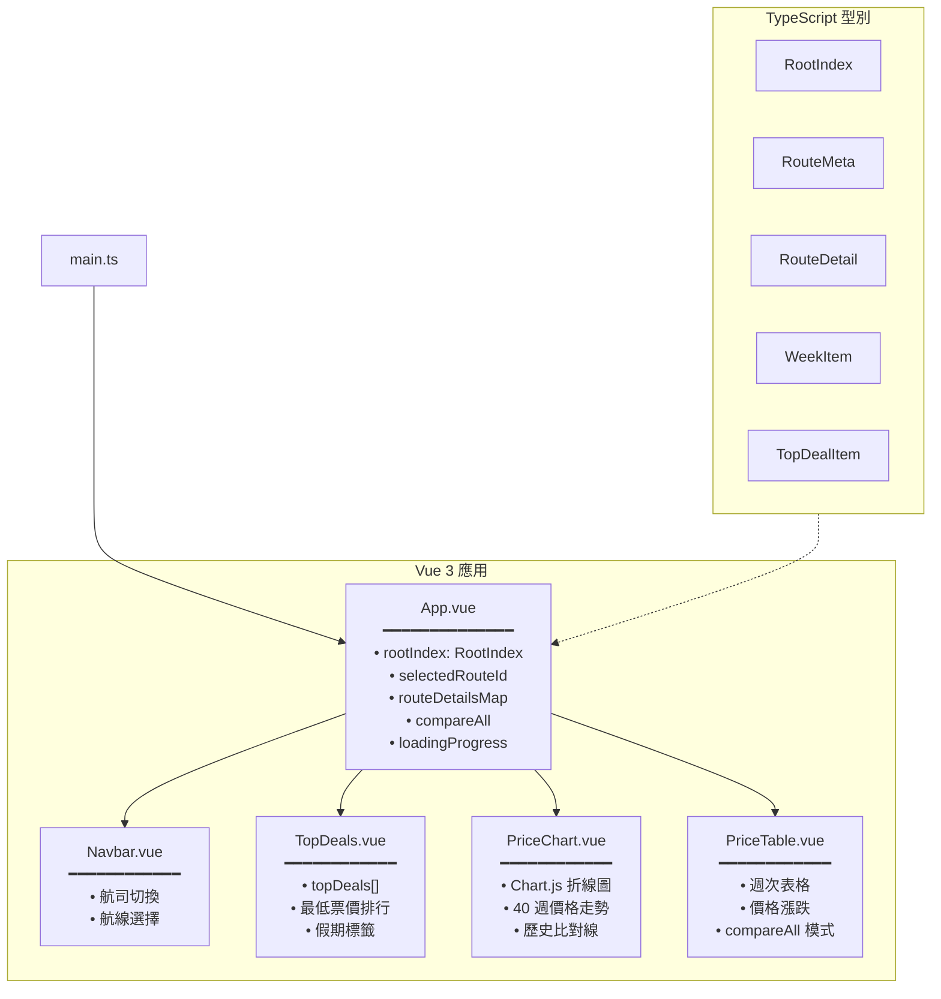
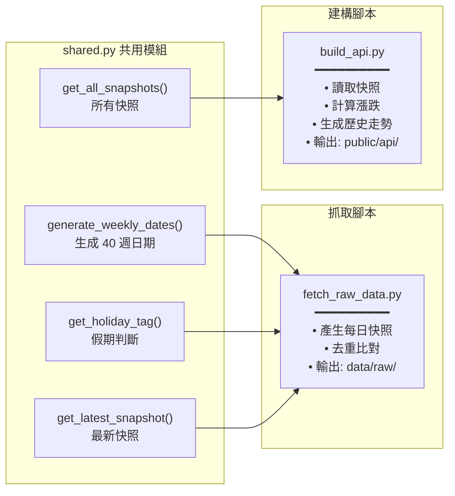

# 專案架構

## 🏗️ 系統架構圖

### 🌐 外部 API 與資料抓取

外部資料源（Google Flights、Amadeus）由 Python 腳本抓取，設定檔定義航線。



### 💾 資料層

抓取的資料儲存為日期快照，供 API 建構器讀取。



### 📡 API 層

API 建構器從快照產生靜態 JSON，供前端 fetch。



### 🎨 前端 Vue 3 + TypeScript

前端元件從 API 載入資料，以圖表和表格呈現票價資訊。



### 🚀 部署

前端建置後自動部署到 GitHub Pages。


---

## 🎨 前端元件樹



---

## 🐍 後端腳本關係圖



---

## 🧰 技術棧清單

### 前端
| 技術 | 版本 | 用途 |
|------|------|------|
| Vue 3 | ^3.4.21 | UI 框架（Composition API + `<script setup>`） |
| TypeScript | ^5.2.2 | 型別安全 |
| Vite | ^5.1.6 | 建置工具 |
| Chart.js | ^4.4.2 | 價格走勢圖表 |
| Tailwind CSS | ^3.4.3 | 樣式系統 |
| PostCSS + Autoprefixer | ^8.4.38 / ^10.4.19 | CSS 處理 |

### 後端（Python 腳本）
| 技術 | 用途 |
|------|------|
| Python 3.x | 腳本執行環境 |
| fast-flights | Google Flights 爬蟲 |
| Amadeus API | 備用票價資料源 |
| requests + beautifulsoup4 | HTTP 請求 |

### 部署
| 技術 | 用途 |
|------|------|
| GitHub Actions | CI/CD 自動化 |
| GitHub Pages | 靜態網站託管 |

---

## 📂 目錄結構說明

```
flight-radar/
├── 📄 package.json              # Node.js 專案設定
├── 📄 vite.config.ts            # Vite 建置設定
├── 📄 tailwind.config.js        # Tailwind CSS 設定
├── 📄 tsconfig.json             # TypeScript 設定
├── 📄 CNAME                     # GitHub Pages 自訂網域
│
├── 📂 scripts/                  # Python 資料腳本
│   ├── shared.py                # 共用工具（日期、假期、價格）
│   ├── routes_config.json       # 航線定義（4 條航線）
│   ├── fetch_raw_data.py        # 原始快照抓取
│   └── build_api.py             # API 建構器
│
├── 📂 data/                     # 原始資料（不公開）
│   ├── routes.json              # 航線清單
│   └── raw/                     # 日期快照目錄
│       └── {airline}/
│           └── {route}/
│               └── YYYY-MM-DD.json
│
├── 📂 public/                   # 靜態資源（建構時複製到 dist）
│   └── api/                     # 前端 API 資料
│       ├── index.json           # 全站索引
│       └── airlines/
│           └── {code}/
│               ├── index.json   # 航司索引
│               └── {route}/
│                   ├── meta.json    # 航線 meta
│                   └── weeks/       # 週資料目錄
│                       └── YYYY-MM-DD.json
│
├── 📂 src/                      # 前端原始碼
│   ├── main.ts                  # 應用進入點
│   ├── App.vue                  # 主控元件
│   ├── style.css                # 全域樣式
│   ├── components/
│   │   ├── Navbar.vue           # 導覽列
│   │   ├── TopDeals.vue         # 最低價推薦
│   │   ├── PriceChart.vue       # 價格走勢圖
│   │   └── PriceTable.vue       # 週價格表格
│   ├── types/
│   │   └── flight.ts            # TypeScript 型別定義
│   └── utils/                   # 工具函式
│
├── 📂 docs/                     # 本文件目錄
│   ├── README.md                # 文件索引
│   ├── architecture.md          # 專案架構
│   ├── data-flow.md             # 資料流程
│   ├── build-deploy.md          # 建置部署
│   └── code-review-flow.md      # Code Review 流程
│
├── 📂 .github/workflows/
│   └── deploy.yml               # GitHub Actions 部署設定
│
└── 📄 CODE-REVIEW-REPORT.md     # 代碼審查報告
```

---

> 本文件由技術文件工程師自動產生，基於專案原始碼分析。
