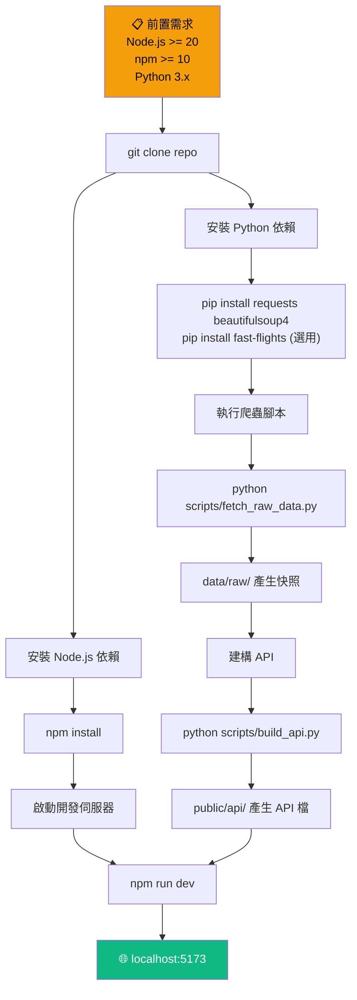
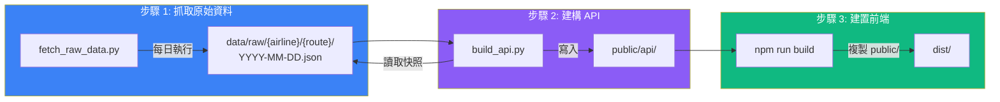
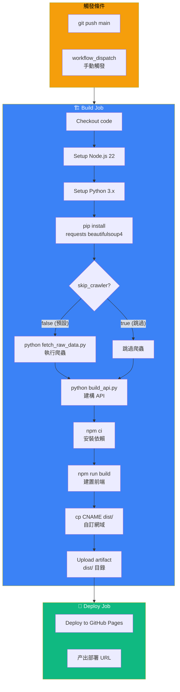
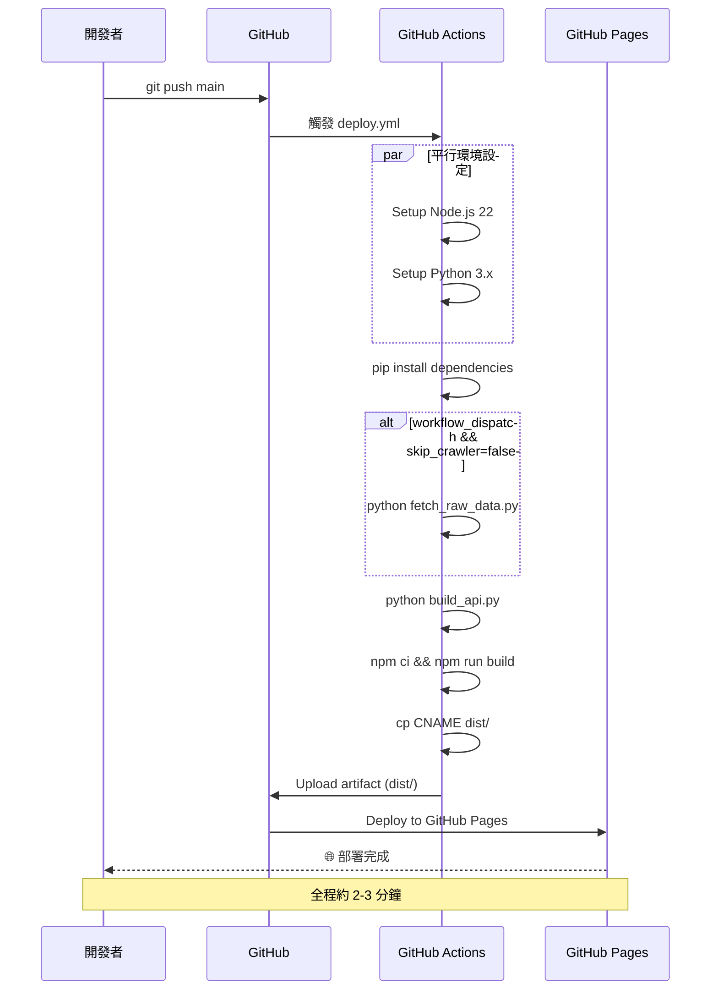
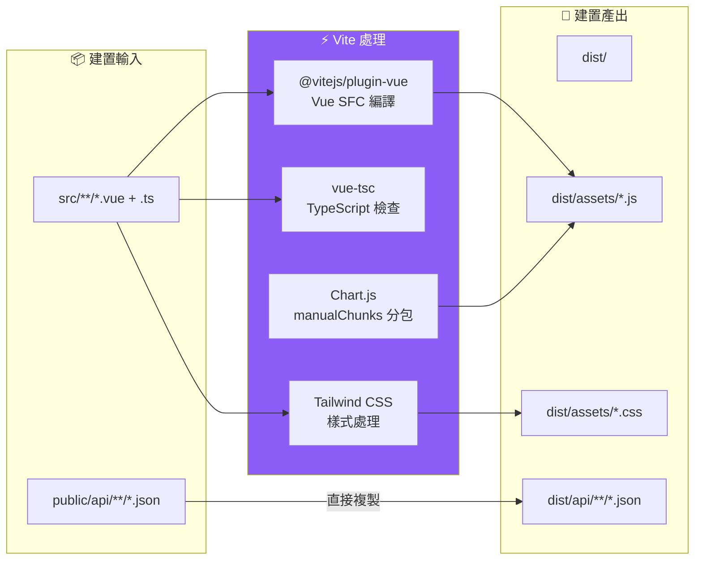
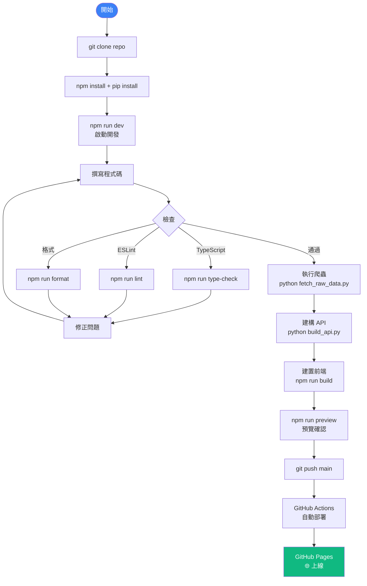

# 建置部署

## 🔧 開發環境設定



---

## 📦 npm Scripts 說明

| 命令 | 說明 | 用途 |
|------|------|------|
| `npm run dev` | 啟動 Vite 開發伺服器 | 本地開發（localhost:5173） |
| `npm run build` | `vue-tsc -b && vite build` | 型別檢查 + 生產建置 |
| `npm run preview` | 預覽建置結果 | 確認 dist/ 產出 |
| `npm run lint` | ESLint 檢查 | 程式碼品質 |
| `npm run lint:fix` | ESLint 自動修正 | 快速修復 |
| `npm run format` | Prettier 格式化 | 程式碼風格 |
| `npm run type-check` | Vue TypeScript 型別檢查 | 型別安全 |

---

## 🐍 Python 腳本執行順序



### 腳本參數

```bash
# fetch_raw_data.py
python scripts/fetch_raw_data.py                  # 使用 fast-flights（預設）
python scripts/fetch_raw_data.py --amadeus         # 使用 Amadeus API
python scripts/fetch_raw_data.py --no-fast-flights # 使用基準行情

# fetch_flights.py (已棄用，改用 fetch_raw_data.py)
python scripts/fetch_flights.py                    # 直接輸出到 public/data/
```

---

## 🚀 GitHub Actions CI/CD 流程



---

## 📤 部署到 GitHub Pages



---

## 🔨 Vite 建置設定



### Vite 設定要點

| 設定 | 值 | 說明 |
|------|-----|------|
| `base` | `'./'` | 相對路徑，支援 GitHub Pages 子目錄 |
| `target` | `es2020` | 瀏覽器相容性 |
| `port` | `5173` | 開發伺服器端口 |
| `host` | `true` | 允許區域網路存取 |
| `manualChunks` | `chart-js` | Chart.js 獨立分包，減少主包大小 |

---

## 📋 完整開發流程



---

> 本文件由技術文件工程師自動產生，基於專案原始碼分析。
