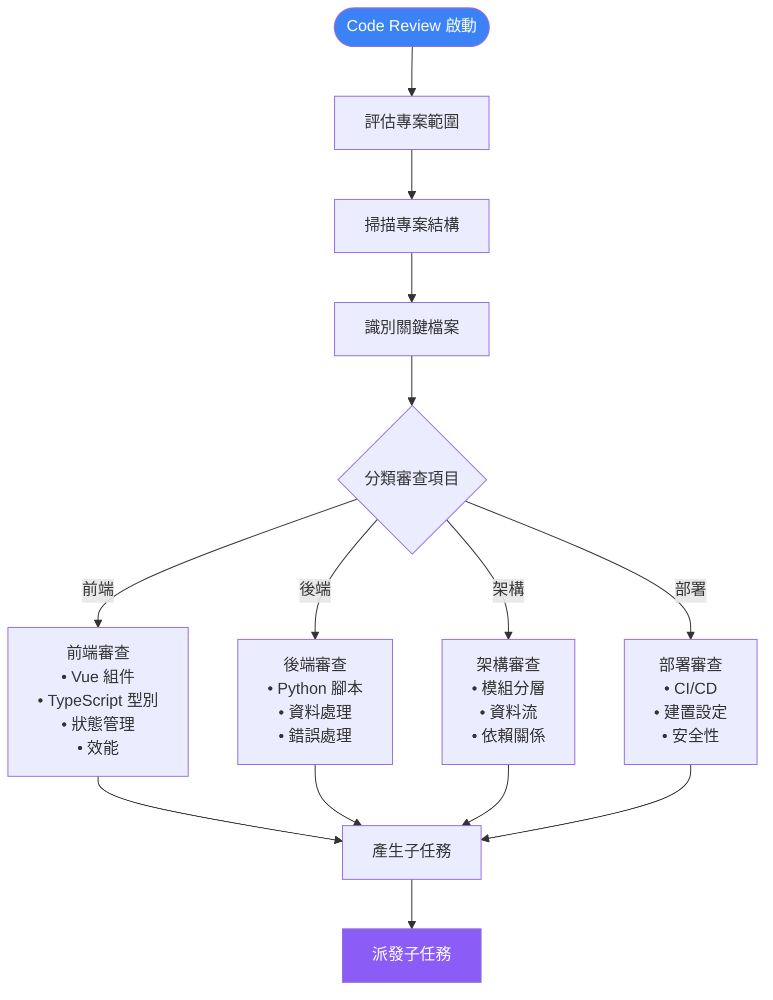
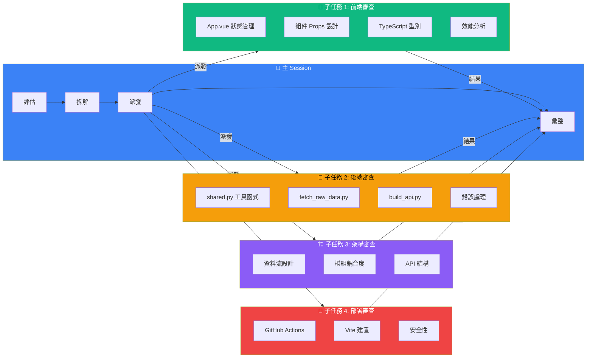
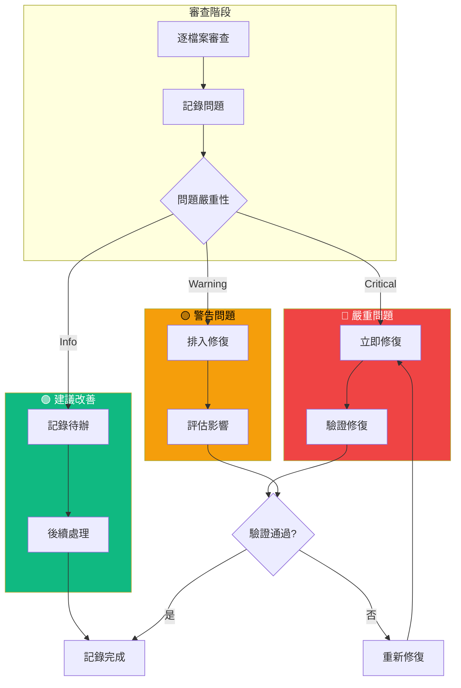
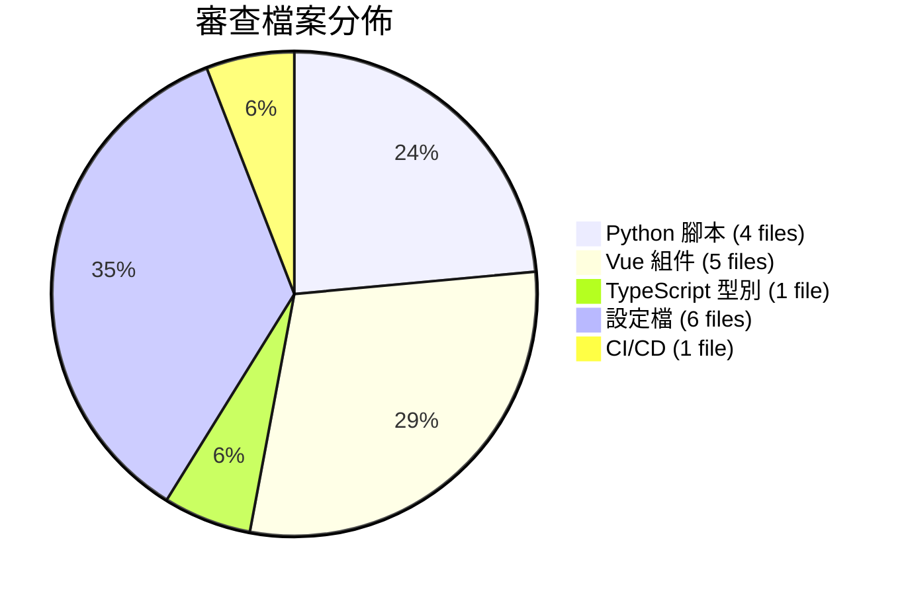
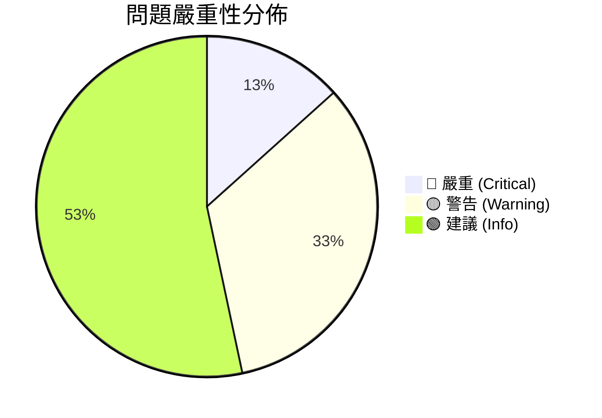
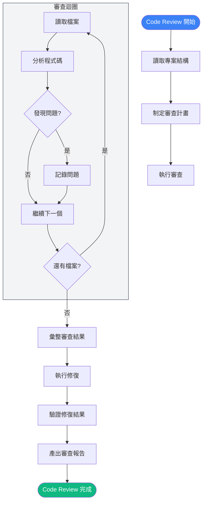

# Code Review 流程

## 📋 本次 Code Review 概覽

| 項目 | 內容 |
|------|------|
| 專案 | flight-radar（華航週末機票 40 週雷達） |
| 審查範圍 | 全專案原始碼 |
| 目標 | 代碼品質、架構合理性、安全性、效能 |

---

## 🔍 拆解評估流程

---

## 📤 子任務派發圖

---

## 🔧 修復流程圖

---

## 📊 結果統計

### 審查範圍

### 問題分類

### 模組審查結果

| 模組 | 檔案數 | 嚴重 | 警告 | 建議 | 狀態 |
|------|--------|------|------|------|------|
| Python 腳本 | 4 | 1 | 2 | 3 | ⚠️ 需改善 |
| Vue 組件 | 5 | 1 | 1 | 2 | ⚠️ 需改善 |
| TypeScript | 1 | 0 | 1 | 1 | ✅ 基本通過 |
| 設定檔 | 6 | 0 | 0 | 1 | ✅ 通過 |
| CI/CD | 1 | 0 | 1 | 1 | ✅ 基本通過 |

---

## 🔄 完整 Review 流程圖

---

## 📝 審查檢查清單

### 前端 (Vue 3 + TypeScript)
- [x] 組件結構合理性
- [x] Props 類型定義
- [x] 響應式狀態管理
- [x] 錯誤處理機制
- [x] 效能優化（懶載入、快取）

### 後端 (Python)
- [x] 腳本功能完整性
- [x] 錯誤處理與回退機制
- [x] 資料格式一致性
- [x] 去重邏輯正確性
- [x] API 建構完整性

### 架構
- [x] 模組分層清晰度
- [x] 資料流合理性
- [x] 依賴方向正確性
- [x] API 結構設計

### 部署
- [x] CI/CD 流程完整性
- [x] 建置設定正確性
- [x] 安全性考量

---

> 本文件由技術文件工程師自動產生，基於 Code Review 執行過程記錄。
