# 資料流程

## 🔄 端到端資料流總覽

資料從外部 API 抓取，經 API 建構，最終在前端視覺化呈現。以下是各階段的詳細流程：

### 1️⃣ 資料抓取（每日快照）

從 Google Flights 或 Amadeus API 抓取票價，儲存為日期快照。

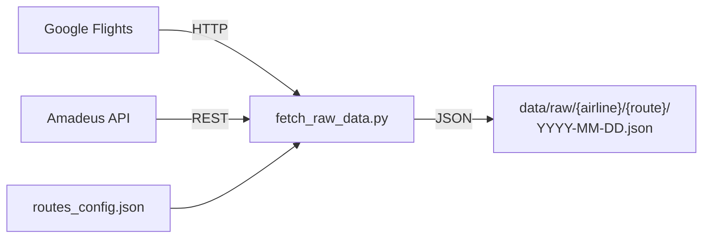

### 2️⃣ API 建構

從快照產生靜態 JSON API，供前端使用。

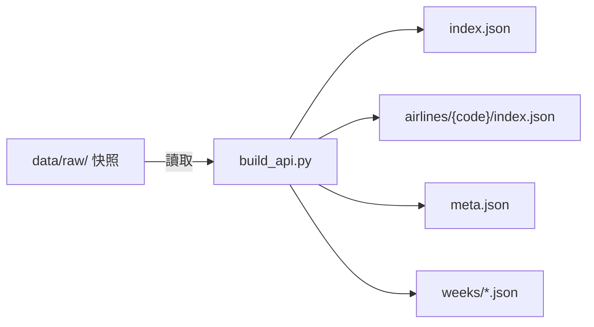

### 3️⃣ 前端載入

前端從 API 載入資料，並行載入週資料。

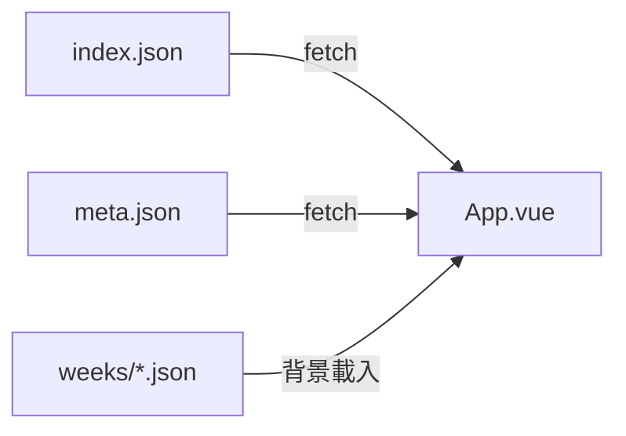

### 4️⃣ 視覺化

前端元件將資料轉換為圖表、卡片、表格。

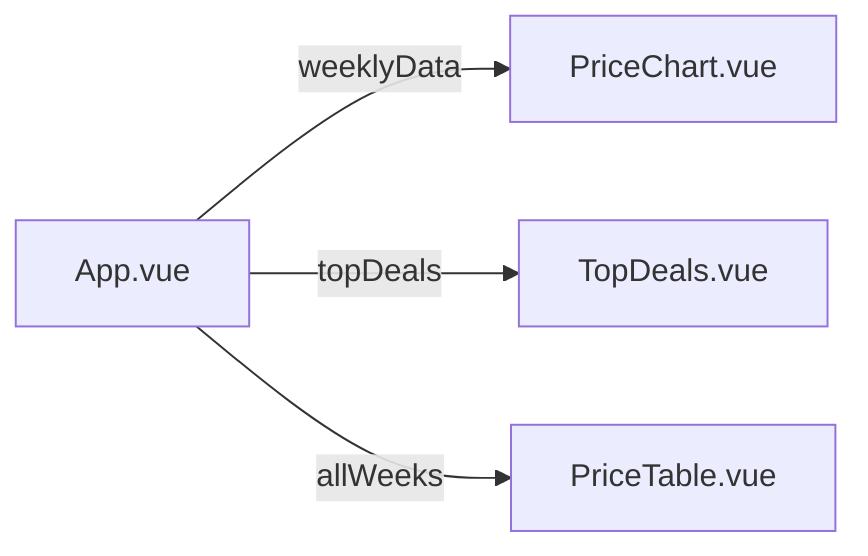

---

## 📥 階段一：資料抓取

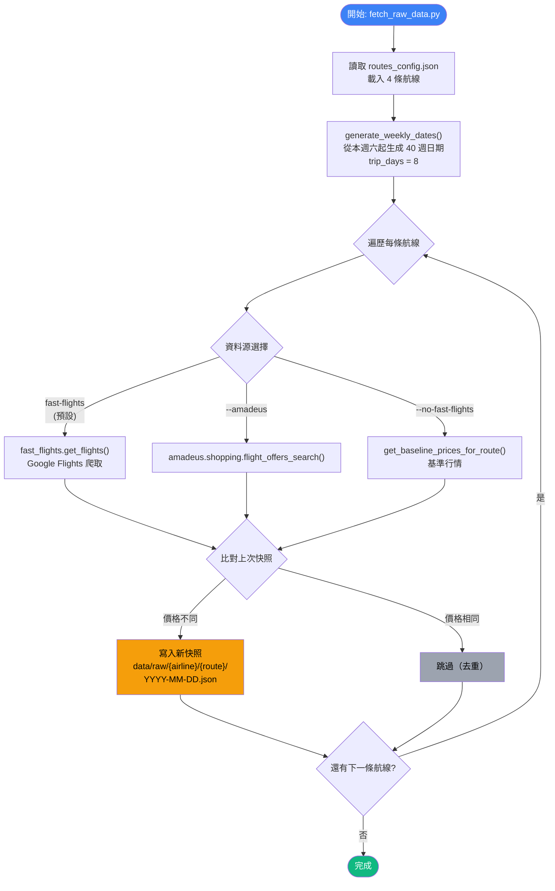

### 快照資料結構

```json
{
  "routeId": "TPE-NRT",
  "airline": "CI",
  "origin": "TPE",
  "destination": "NRT",
  "queryDate": "2025-09-01",
  "capturedAt": "2025-09-01 14:30:00 (UTC+8)",
  "dataSource": "fast-flights",
  "weeksCount": 40,
  "flights": [
    {
      "weekIndex": 1,
      "departureDate": "2025-09-06",
      "returnDate": "2025-09-14",
      "label": "09/06~09/14",
      "tag": null,
      "isHoliday": false,
      "price": 14744,
      "currency": "TWD"
    }
  ]
}
```

---

## 🏗️ 階段二：API 建構

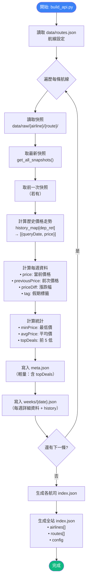

### meta.json 結構

```json
{
  "id": "TPE-NRT",
  "name": "台北桃園 ⇄ 東京成田",
  "airline": "CI",
  "airlineName": "中華航空",
  "weeksCount": 40,
  "latestQueryDate": "2025-09-01",
  "totalSnapshotsRecorded": 15,
  "stats": {
    "minPrice": 13106,
    "avgPrice": 16500
  },
  "topDeals": [
    {
      "weekIndex": 12,
      "departureDate": "2025-11-22",
      "returnDate": "2025-11-30",
      "label": "11/22~11/30",
      "tag": "賞楓銀杏旺季",
      "price": 13106
    }
  ]
}
```

### 週資料結構（含歷史）

```json
{
  "weekIndex": 12,
  "departureDate": "2025-11-22",
  "returnDate": "2025-11-30",
  "label": "11/22~11/30",
  "tag": "賞楓銀杏旺季",
  "isHoliday": true,
  "price": 13106,
  "previousPrice": 13450,
  "priceDiff": -344,
  "history": [
    { "queryDate": "2025-08-15", "price": 14200 },
    { "queryDate": "2025-08-22", "price": 13800 },
    { "queryDate": "2025-08-29", "price": 13450 },
    { "queryDate": "2025-09-01", "price": 13106 }
  ]
}
```

---

## 🎨 階段三：前端載入流程

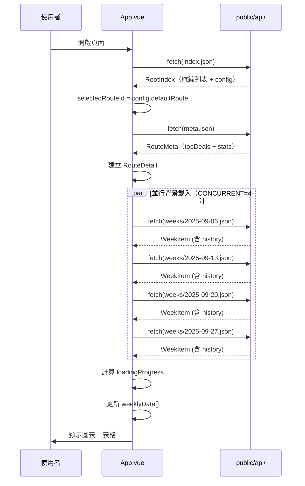

### 前端資料流轉換

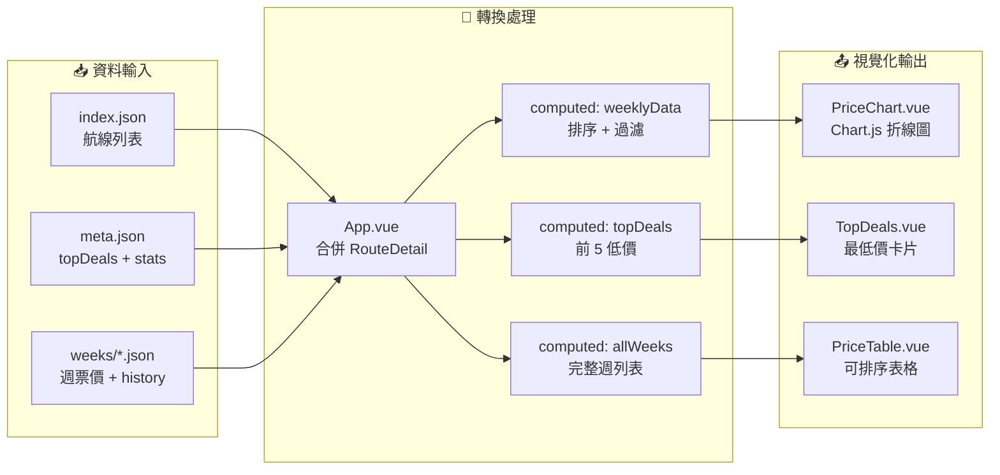

---

## 📊 價格歷史比對邏輯

### 計算當前 vs 前次價格

比較最新快照與前一次快照的價格，計算漲跌幅。

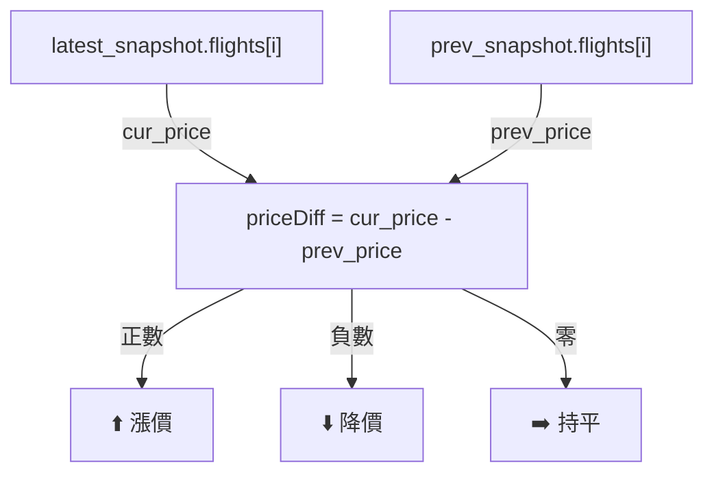

### 歷史走勢聚合

將多次快照的價格依日期聚合，產生歷史走勢資料。

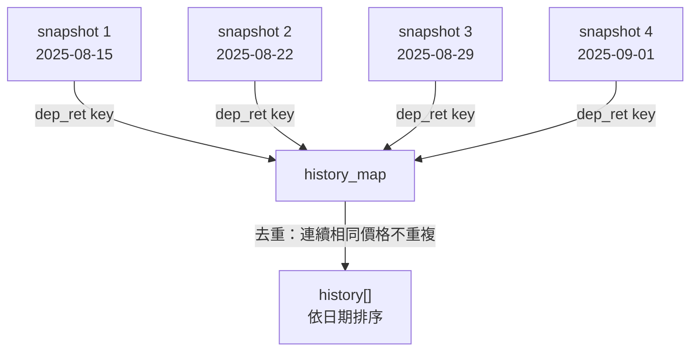

### 假期標籤乘數

假期標籤會影響票價顯示的倍數與加成。

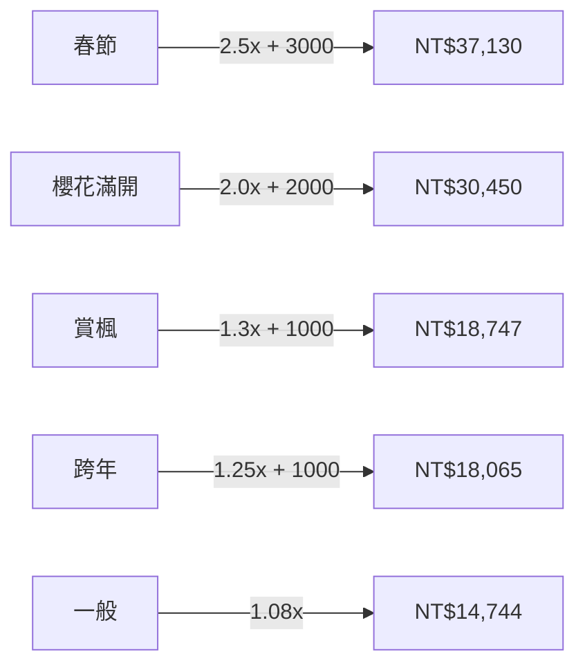

---

## 📁 目錄結構對應

```
資料流向圖:

data/raw/                          public/api/
├── CI/                            ├── index.json
│   ├── TPE-NRT/                   │   (全站索引)
│   │   ├── 2025-08-15.json ──┐    │
│   │   ├── 2025-08-22.json ──┤    ├── airlines/
│   │   ├── 2025-08-29.json ──┤    │   └── CI/
│   │   └── 2025-09-01.json ──┤    │       ├── index.json
│   ├── TPE-KIX/    build_api.py   │       ├── TPE-NRT/
│   ├── TPE-FUK/    ────────────→  │       │   ├── meta.json
│   └── TSA-HND/                   │       │   └── weeks/
│                                   │       │       ├── 2025-09-06.json
                                   │       │       ├── 2025-09-13.json
                                   │       │       └── ... (40 files)
                                   │       ├── TPE-KIX/
                                   │       └── ...
                                   └── (前端 fetch)
```

---

> 本文件由技術文件工程師自動產生，基於專案原始碼分析。
